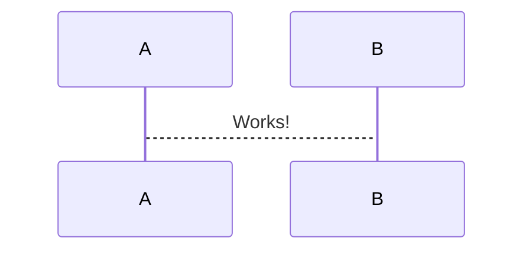

# Desafio Mata-Mata

## Funcionalidades Mínimas

- [✅] Cadastro de novos torneios  ([POST] /tournament)
- [✅] Cadastro dos competidores   ([POST] /tournament/<id>/competitor)
- [✅] Listar💡                    ([GET]  /tournament/<id>/competitor)
- [✅] Listagem de partidas🚨      ([GET]  /tournament/<id>/match)
- [✅] Iniciar torneio💡🚨         ([POST] /tournament/<id>/start)         
- [✅] Salvar resultado partidas🚨 ([POST] /tournament/<id>/match/<id>)
- [✅] Exibição do TOP4            ([GET]  /tournament/<id>/result)

## Próximos passos
- [✅] Terminar API de resultado
- [✅] Código retorno 400, 201 para criação
- [✅] Revisar se precisa ter um jogo a mais para definir 3o e 4o lugar
- [✅] Número de competidores impar passam para próxima rodada
- [✅] Fazer testes dos fluxos alternativos
- [  ] Bug 6 jogadores que na fase dois temos numero impar de competidores
- [  ] Revisar/Melhorar organização do projeto/código
- [  ] Colocar as consultas em manager
- [  ] Limpar projeto
- [  ] Criar documentação

## TODO

- [x] salvar resultado
- [x] salvar resultado revisando prox. game/level
- [x] mvp frontend para visualizar resultados
- [x] escrever mais testes
- [ ] tipar os tipos parametros, ex. tournament_id esta string
- [x] listar top 4
- [ ] doc inicial
- [ ] melhorar listar matches
- [ ] listar tournament
- [ ] adicionar estado tournament
- [ ] remover accounts

tour = Tournament.objects.all().first()

player = 'Alex Eala|Diana Shnaider|Polina Kudermetova|Kristina Dmitruk|Germany Mara Guth|John Doe|Oliva Galvones|Player One|Player Two|Rafael Nadal|Roger Federer|Leo Borg|Bruno Kuzuhara|Daniel Aguilar|Ethan Quinn|Tarantino'.split('|')

for name in players:
    tournaments_svc.create_competitor(tour.id, name)
